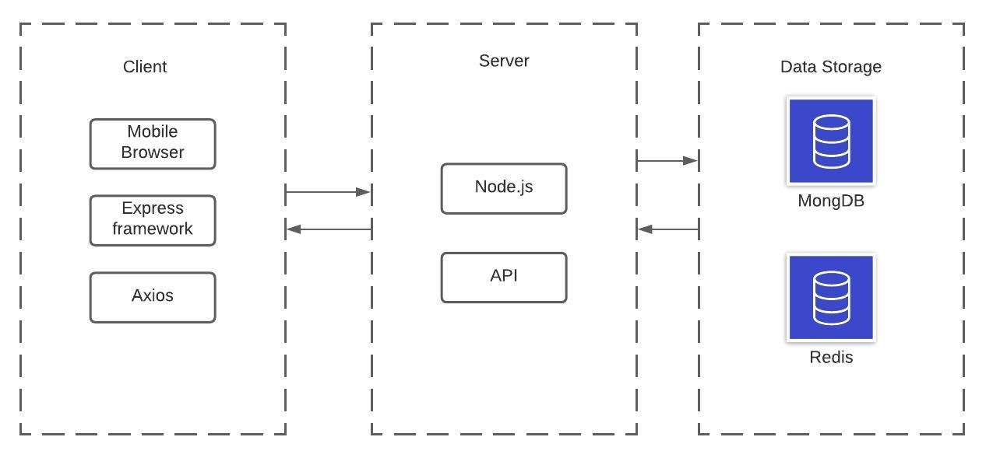
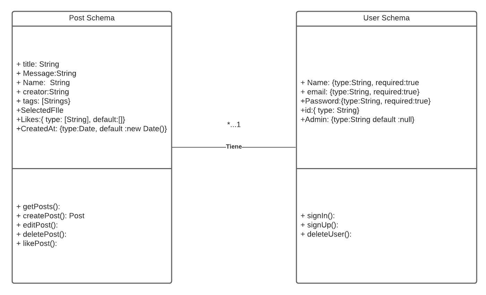
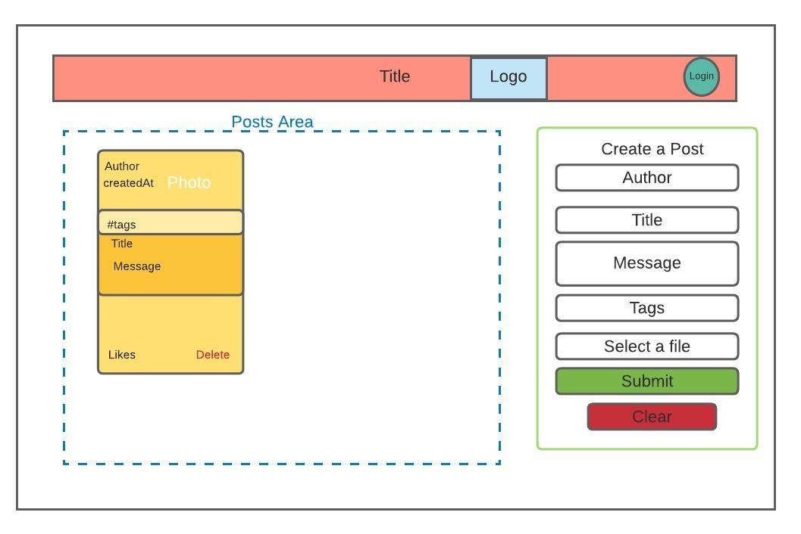
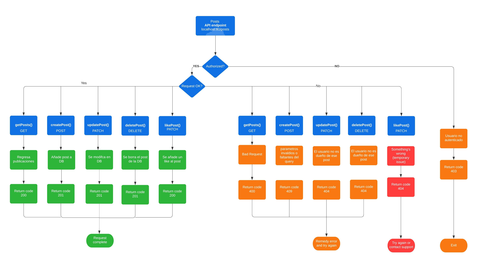
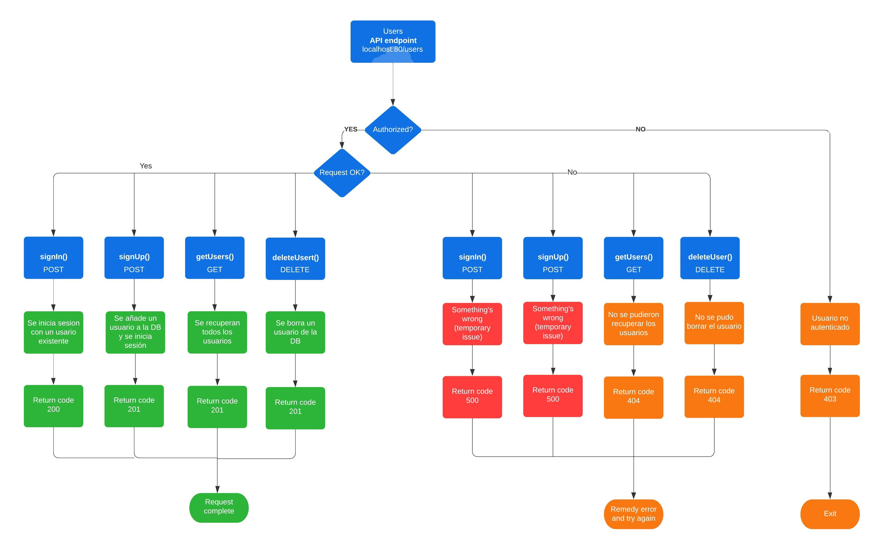

# Red Social - Post It
---

##### Autores:
1. Patricio Tena Zozaya
2. Francisco Acuña Franco 

---

## 1. Estructura del repositorio
```
- / 			        # Raíz de todo el proyecto
    - README.md			# Archivo con los datos del proyecto (este archivo)
    - docker-compose.yml # Archivo de docker para levantar el proyecto
    - client			# Carpeta con la solución del frontend (Web app)
    - server			# Carpeta con la solución de la API o el backend
    - docs			    # Carpeta con la documentación del proyecto
```


## 2. Descripción del proyecto

El proyecto que se realizó fue una red social en donde los usuarios pueden crear publicaciones compuestas por un Título, una imagen, una descripción y un conjunto de etiquetas. De igual manera, cada usuario registrado puede darle " un like" a cada publicación (incluyendo la de ellos mismos) y solamente si eres creador de esa publicación puedes editarla o borrarla.
Por otro lado, un usuario adminstrador puede borrar cualquier publicación y tiene acceso a un dashboard en el que puede ver a los usuarios registrados y eliminarlos.
## 3. Solución

A continuación aparecen descritos los diferentes elementos que forman parte de la solución del proyecto.

### 3.1 Modelos de *bases de datos* utilizados

Para la solución de este problema se utilzo un cluster de MongoDB en Atlas. Esto porque al ser una base de datos NoSQL nos permite darle una mayor flexibilidad al tipo de publicaciones que se pueden crear, de igual manera nos permite almacenar grandes cantidades de información sin la necesidad de tener mucho almacenamiento.

También se utilizó RedisLabs para almacenar los tokens de sesiones temporales.

#### 3.1.1 MongoDB
En MongoDB almacenamos la información de las publicaciones junto con la imagen seleccionada (representada en base 64), al igual de almacenar los usuarios registrados en la red social.
#### 3.1.2 Redis
Para crear las sesiones de redis, se genera un token cuando el usuario inicia/crea una sesion, a ese token generado se le asignan 3600 segundos de expiración los cuales son refrescados cada que el usuario interactua con la página.

### 3.2 Arquitectura de la solución
#### 3.2.1 Arquitectura completa del poryecto

#### 3.2.2 Modelos de las bases de datos

#### 3.2.3 Arquitectura del frontend

### 3.3 Frontend
La aplicación utiliza ReactJS que nos permite crear una aplicación frontend web que facilita la conección a bases de datos NoSQL, así como facilitar la implentación de la parte visual de la página.

Para desplegar la información recuperada del backend se utilizaron librerias como mongoose y axios.

#### 3.3.1 Lenguaje de programación
Se utilizaron lenguajes como JavaScritpt, HTML y CSS.
 

#### 3.3.2 Framework
Para el frontend se utilizó un framework llamdo Express JS.
#### 3.3.3 Librerías de funciones o dependencias
- Materia-UI: Componentes de react que facilitan el desarollo web
    - @material-ui/core
    - @material-ui/data-grid
    - @material-ui/icons
- axios: Maneja los requests de HTTP al servidor Node.js
- jwt-decode: Genera el token de usuario único
- moment: Facilita el display de imagenes y de fechas
- react-file-base64: Codfifica fotografías en base 64 para almacenarlas en la base de datos de MongoDB
- react-google-login: Implementa la autenticación de usuarios utilizando su cuenta de Google
- react-redux: Gestiona el cambio de estados para mantener consistencia entre cliente y servidor


### 3.4 API o backend

*[Incluya aquí una explicación de la solución utilizada para implementar la API del proyecto. No olvide incluir las ligas o referencias donde se puede encontrar información de los lenguajes de programación, frameworks y librerías utilizadas.]*
El backend o servidor utilza Node.js para correr, además de eso realiza operaciones RESTful (post, get, etc.) a la bases de datos mencionadas anteriormente.
#### 3.4.1 MongoDB Atlas
De la siguiente manera se crea la conexión a MongoDB(Utilizando Mongoose):

        const PORT = process.env.PORT;

        mongoose.connect(process.env.CONNECTION_URL, { useNewUrlParser: true,       
        useUnifiedTopology: true})
            .then(()=> app.listen(PORT, () => console.log(`Server running on port: ${PORT}`)))
            .catch((error)=> console.log(error.message));

        mongoose.set('useFindAndModify', false);

> Los datos de connexión tienen que estar definidos en un archivo *.env* tal como se espeficia en el archivo *.env.example*
#### 3.4.2 RedisLabs
De la siguiente manera se crea la conexión a RedisLabs:

        const client = redis.createClient({
            host: 'redis-13279.c62.us-east-1-4.ec2.cloud.redislabs.com',
            port: 13279,
            password: '******************'
        })

        client.on('error', err => {
            console.log('Error ' + err);
        });

        export default client;
> los asteriscos represantan donde iria la contraseña

#### 3.4.3 Lenguaje de programación
Se utilizó JavaScritpt y operaciones tipo RESTful
#### 3.4.4 Framework
Para el backend no se utilizó ningun framework
#### 3.4.5 Librerías de funciones o dependencias
- bcryptjs: Enctipta contraseñas
- body-parser: Interpreta los datos regresados de una llamada a la base de datos
- cors: Implementa políticas de seguridad en las conexiones
- dotenv: Permite usar variables de entorno para las conexiones a los DB
- express
- jsonwebtoken: Genera el token único de cada usuario
- mongoose: Se utilizó para hacer requests al cluster de MongoDB
- redis: Se utilizó para hacer requests al cluester de Redislabs

### Endpoints
Posts

Users

## 3.5 Pasos a seguir para utilizar el proyecto

1. Clonar el repostirorio
        
        git clone https://github.com/tenapato/post-it
2. Cambiarte a la ubicación del repostirorio
        
        cd tc3041-csfpf-primavera-2021-team-15
* Nota: Para correr todo con el archivo docker-compose, saltarse hasta el paso 7
3. Abrir una terminal y meterte a la carpeta de *Client* y compilar la imagen

        docker build --tag client .
4. Levantar el contenedor del cliente asignadole el puerto 3000

        docker run -p 3000:3000 cliente
5. Abrir una terminal y meterte a la carpeta de *Server* y compilar la imagen

        docker build --tag server .
6. Levantar el contenedor del cliente asignadole el puerto 80

        docker run -p 80:80 server
*A partir de este paso, solamente restaria conectarse al cliente, pero si se quieres correr con el docker-compose para utilzar el load balancer:

7. Compilar la imager con el docker-compose

        docker-compose build 
8. Levantar la imagen

        docker-compose up
9. Para levantar la aplicación con el Load balancer:
        
        docker-compose up --scale server=3
    > Donde '3' es el número de servidores a levantar
10. Conectarse al link del client: http://localhost3000
11. Para apagar el contenedor

        docker-compose down
> Nota: en la version de prueba el usuario administrador es : adminuser@gmail.com y la pswd es admin
## 4. Referencias

- https://es.reactjs.org/
- https://expressjs.com/es/
- https://material-ui.com/es/
- https://github.com/axios/axios
- https://react-redux.js.org/
- https://nodejs.org/es/
